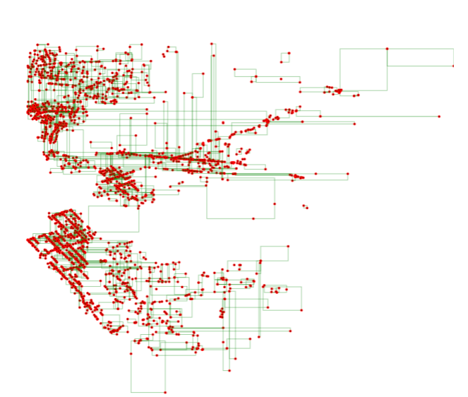

# RTree implementation in C++ with data persistence
 
## Install Dependecies

- Boost
```
sudo apt update
sudo apt install libboost-all-dev
```
- nlohmann-json
- google-test
```
installed by cmake
```
## Build, compile and test the RTree datastructure
```bash
mkdir build
cd build
cmake ..
make
ctest 
```

## To run the demo

### RTree templating
To choose the parameters of the RTree you must modify them in the demo/main.cpp file.
You can find them after the includes
```c++
// parameters
const size_t dimensions = 2;
const size_t leafCap = 1024 * 4;
const size_t internCap = 64;
const size_t poolCap = 1000;
```
where:
- dimensions are the number of dimensions of the rtree
- leafCap is the maximum number of points in any leaf
- internCap is the maximum number of child nodes in any node
- poolCap is the maximum number of nodes loaded in ram


### Data loading
Download the data with the next commands and then add its paths in the config/config.json file
```bash
cd ../data
wget # copy 1 or sveral links from source.txt and paste it here to download 
```
* Tested with the green_tripdata files and up to 13M data points

### Configuration

modify the config/config.json file to load the downloaded data following the sample.
then execute the demo with theese commands if RTree parameters in demo changed.
```bash
cd ../build
make
time ./Demo config.json
```
\* config.json is copied from the config directory by the make command
And with theese commands if not:
```bash
cd ../build
cp ../config/config.json .
time ./Demo config.json
```
### Rendering
if "render":true then there will be an RTree.svg file in the same build directory. you can open it with your browser.
keep in mind that you should render only with less than 40k points or your browser will suffer.

### Filter
the "Filter" and "doFilter" configuration parameters
are used to clean the data inserted into the RTree.
This is useful when "render":true.

## Persistence
since the RTree is stored in disk you can add more files in
the build/config.json file and re-run the demo to load more datapoints.
however if "boostTest":true for the second time results may vary since our RTree would have more points loaded.

\* if you change the RTree parameters then delete all the nodes in the nodes/ subdirectory and load the data from 0.